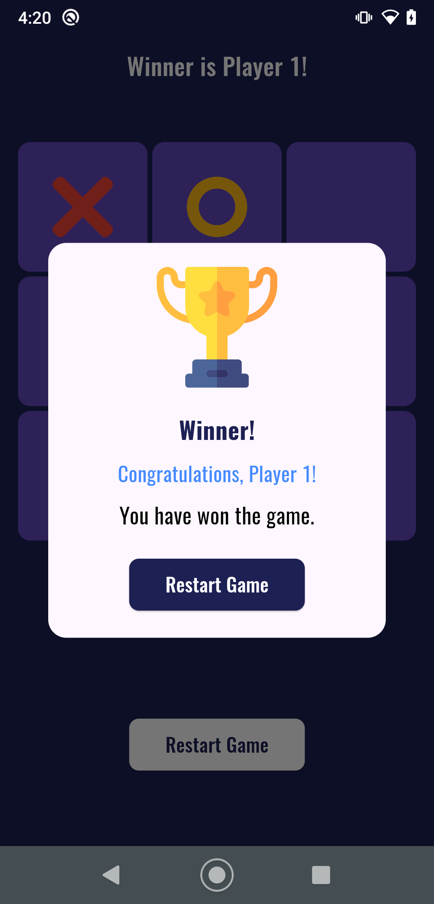
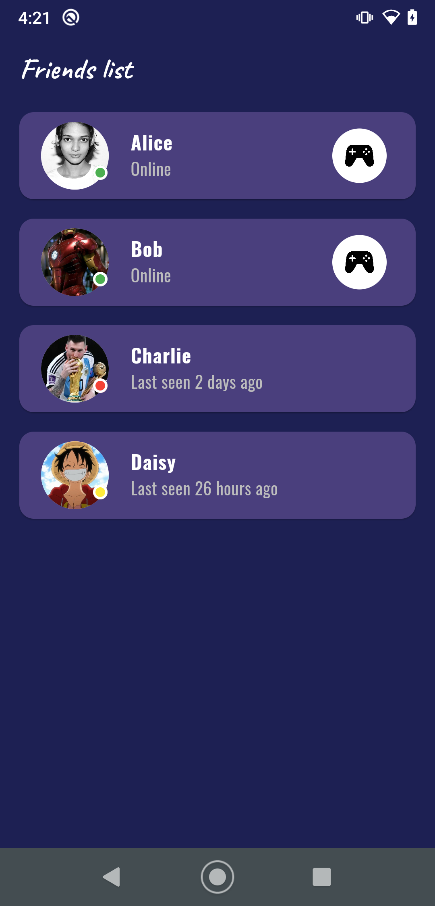

# 🎮 Tic Tac Toe App

Welcome to Tic Tac Toe App! A classic game reimagined for your mobile device, built with Flutter. Enjoy this timeless game that combines fun and strategy, all within an easy-to-use interface.

## ✨ Features

- **Classic Gameplay**: Play the traditional Tic Tac Toe game with a smooth and intuitive interface.
- **Multiplayer Mode**: Compete with friends or family in two-player mode.

## 🚀 Getting Started

To get started with **Tic Tac Toe App**, follow these steps:

1. **Clone the Repository**

   ```
   git clone https://github.com/shiburajrs/tic-tac-toe-game.git
   cd notes_app
   ```


2. **install Dependencies**

   ```bash
   flutter pub get
   ```

3. **Run the App**

```bash
flutter run
```


## 📸 Screenshots

Here are some screenshots of the **Tic Tac Toe** in action:


<div align="center">
  
  
  <br>
  
  
  <br>
  
  
  
 
</div>